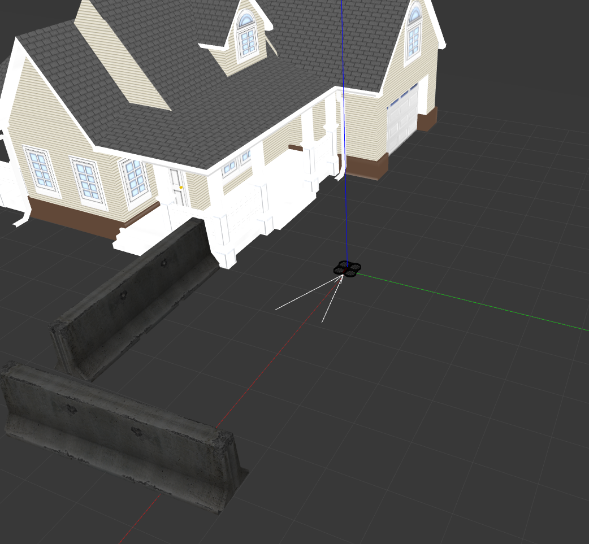

# ardrone_quadrotor

This repository is the simulation of the famous parrot ardrone quadrotor compatible with ROS Noetic and Gazebo Classic 11.15. It is based on the following repositories:

- [ardrone_gazebo](https://github.com/PXLRoboticsLab/ardrone_gazebo)
- [ardrone_autonomy](https://github.com/PXLRoboticsLab/ardrone_autonomy)
- [TheConstructCore](https://bitbucket.org/theconstructcore/parrot_ardrone/src/master/)



## Start the simulation

```
roslaunch ardrone_gazebo intro.launch
```


## Control 
Keyboard teleopration

```
rosrun custom_teleop teleop_twist_keyboard.py
```

Perform open-loop square
```
rosrun drone_demo square_move.py
```

Switch to position-mode
```
rostopic pub /ardrone/posctrl std_msgs/Bool "data: true"
```